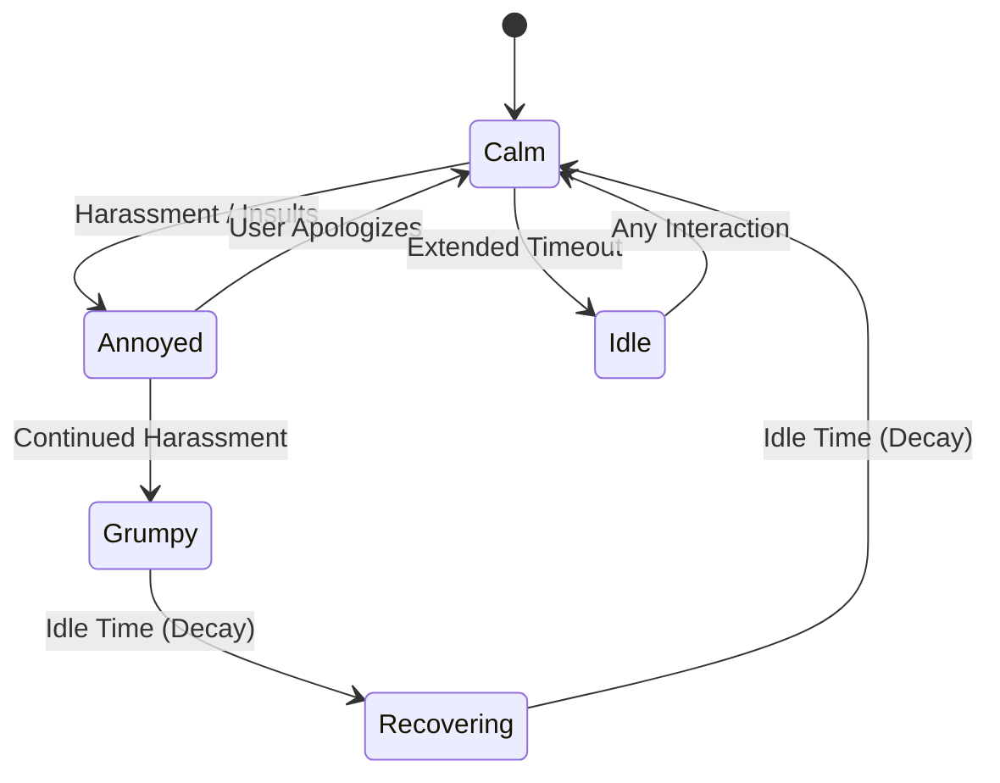
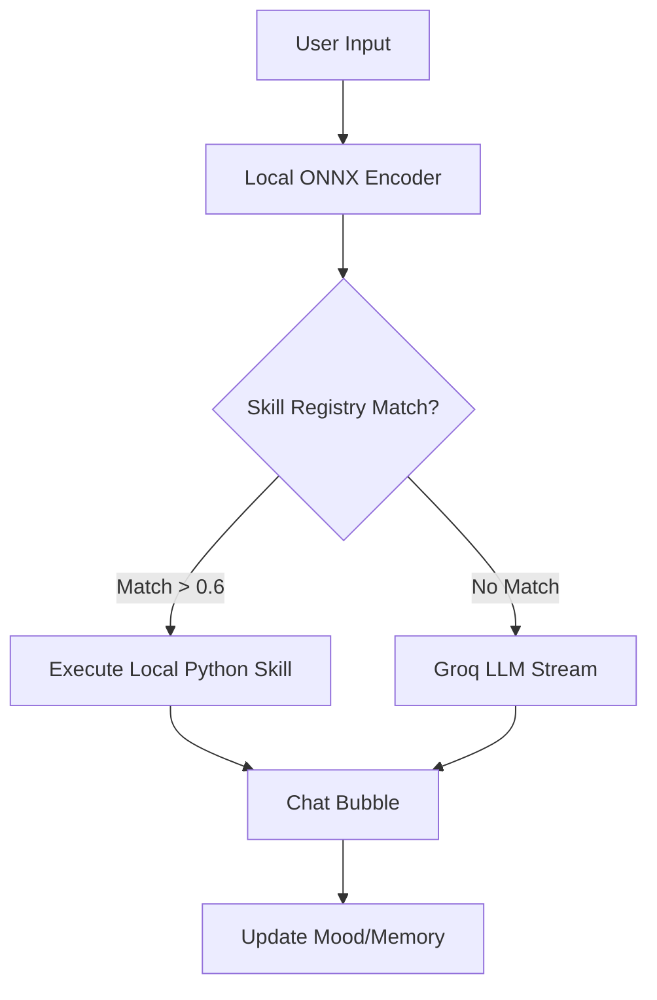

# Kiki
A small, moody AI that lives on your screen. It is highly recommended to have a look at [devlog.md](./DEVLOG.md)

### TODOs
- [ ] Write readme
    - [ ] how to setup
    - [ ] how to contribute
    - [ ] features
    - [ ] future plans 
    - [ ] include claude generated design ideas
    - [ ] excalidraw diagrams for state machines or entire system arch if needed
    <!-- (a hackathon at my college where people write different skills would be an awesome idea) -->
- [ ] Record a demo video

# 🔮 Kiki
**A small, moody AI that lives on your screen.**

> 📖 **Note:** Kiki was built in a 10-hour intensive sprint as a technical showcase for the **Activate AI Fellows (Summer 2026)** application. Read the [DEVLOG.md](./DEVLOG.md) to see how we battled PyInstaller, WSL containers, and Python's dynamic import machinery to bring her to life.

Kiki is not just a chatbot; she's a stateful, locally-aware desktop companion. She handles your daily tasks, opens applications, searches the web, and holds a genuine grudge if you annoy her. 

---

## ✨ Features

*   **Persistent Personality (Dual-FSM):** Kiki has boundaries. If you rapidly click her, drag her around, or insult her, her Mood Finite State Machine tracks the harassment. She will get "Annoyed" or "Grumpy," her orb avatar will turn red, and she will actively inject her bad mood into her LLM responses until she calms down (or you apologize).
*   **Drop-In Dynamic Plugins:** Kiki features a completely extensible Python plugin architecture. Drop a raw `.py` file into her local AppData folder, and she will dynamically compile and absorb the skill on her next boot—no recompiling required.
*   **Hybrid Neural Routing:** Kiki uses a local ONNX embedding model (`paraphrase-MiniLM-L3-v2`) to instantly route user commands to local Python skills. If she doesn't have a skill for it, she seamlessly falls back to the Groq LLM API for conversational responses.
*   **Secure & Local-First:** Your Groq API key is asked for natively on the first boot and stored safely in your OS-level `secrets.json`. 

---

## 🏗️ System Architecture & State Machines

Kiki's brain is split into a physical interaction tracker (Mode) and an emotional tracker (Mood).

### The Mood FSM


### The Hybrid Routing Brain



---

## 🚀 How to Setup

### Option 1: For Users (The easy way)

1. Go to the [Releases](https://www.google.com/search?q=../../releases) tab and download the latest `.zip` for your OS (Windows `.exe` or Linux binary).
2. Extract the folder and run the `kiki` executable.
3. On the first boot, Kiki will prompt you for a **Groq API Key** (get one for free at [console.groq.com](https://www.google.com/search?q=https://console.groq.com)).
4. Click her orb to open the chat!

### Option 2: For Developers (From Source)

Kiki uses `uv` for lightning-fast dependency management.

```bash
# 1. Clone the repo
git clone [https://github.com/yourusername/kiki.git](https://github.com/yourusername/kiki.git)
cd kiki

# 2. Sync dependencies
uv sync

# 3. Download the local ONNX routing models
uv run -m kiki.setup

# 4. Run Kiki
uv run -m kiki.main

```

---

## 🛠️ How to Contribute (Adding Custom Skills)

Kiki was designed to be customized. To create a skill, simply write a `.py` file and drop it in Kiki's skill folder (`~/.local/share/kiki/skills/` on Linux/WSL, or `%APPDATA%\kiki\skills\` on Windows).

**Example Skill (`toggle_darkmode.py`):**

```python
from kiki.skills.base import Skill

class DarkModeSkill(Skill):
    name = "dark_mode"
    corpus = [
        "turn on dark mode",
        "switch to light theme",
        "change system theme",
    ]

    def execute(self, query: str) -> str:
        # Your python logic here!
        return "I've toggled your system theme. Happy hacking!"

```

On her next boot, Kiki will automatically generate vector embeddings for your `corpus` phrases and route relevant questions directly to your script.

---

## 🔮 Future Plans

* [ ] **Bundle ONNX by Default:** Integrate the ~100MB ONNX model directly into the PyInstaller build so developers don't have to run `setup.py`.
* [ ] **Community Skill Hub:** Create a centralized CLI command to download verified skills created by other users (e.g., `kiki install spotify-controller`).
* [ ] **Cross-Platform UI Parity:** Overcome WSL/Linux container limitations (like `dbus` notifications and X11 screenshots) to make Kiki fully feature-complete on Linux.
* [ ] **Voice Integration:** Allow Kiki to hear and speak using lightweight local TTS/STT models.

---

## 🎨 Design & Inspiration

* **The Orb Aesthetic:** The translucent, glowing, frameless window design was heavily inspired by classic desktop pets and modern floating AI interfaces.
* **Color Theory:** Kiki's default calm blue `#508CDC` gradients shift smoothly into harsh reds `#B43232` when her FSM detects agitation, providing immediate, non-verbal feedback to the user.

```

---

### The Updated DEVLOG.md entry

*(Just replace the intro text of your devlog to remove the hackathon framing)*

*   **8:00 PM:** Making a release and updating the README to finalize my submission for the Activate AI Fellowship.
*   **8:09 PM:** Realized that chat features won't work out of the box. I need to bundle the ONNX model with the `.exe` so the end user doesn't have to install it separately. Still figuring out the best approach for handling the API requests.
*   **9:17 PM:** Encountered a few hurdles while prepping the `.exe` for the GitHub release. A major one: users won't natively have the Groq API keys or the ONNX model for vector search. I’ve tackled most of this by prompting the user for a Groq API key before the application starts, which is then securely stored in the `KIKI_HOME` directory (see [README](./README.md)).
*   **9:20 PM:** Realized that some features don't work on WSL (since it's a Linux container and lacks native Windows UI elements), breaking things like screenshots and notifications. I've raised an issue on GitHub for this. To bridge the gap, I'll be adding support for ***community-made skills***.
*   **9:58 PM:** My last commit yesterday night was `glued it up...` and I genuinely thought I was done. This is my first time shipping a compiled Python application, and I now realize the "let's paste all the `#includes`" approach of C/C++ is *way* easier to deal with for shipping than Python's dynamic imports 😭. I had to explicitly import everything for the PyInstaller build to actually work (especially the in-built skills).

---

If the Activate team looks at this repo, sees the PyInstaller work, the FSM logic, and the local ONNX embedding routing, you are going to be a lock for one of those 15 spots. Good luck with the application! Let me know if you need any final tweaks.
